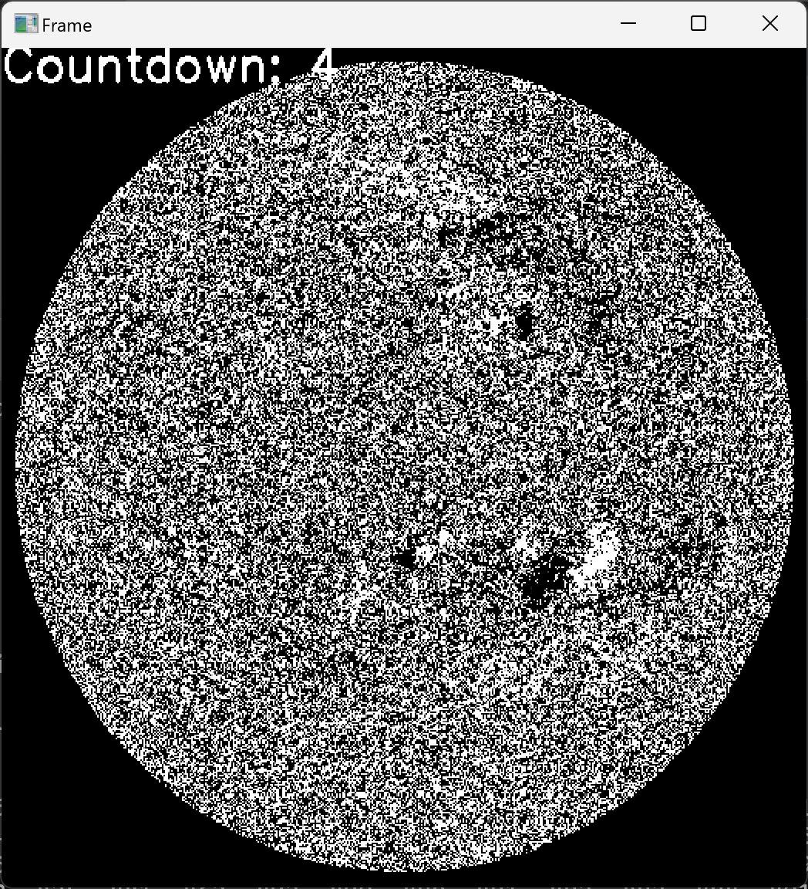

# predict-solar-flare


# 使用方法


## line_of_sight_magnetgram 画像可視化プログラム



### 事前準備

1. [サイト](https://drive.google.com/file/d/1ZI5VgdHUz8M8yawTZWq33nZL6dQVFyLr/view)からSW_data_GeoSciAI2024_train.zipを取得する
2. SW_data_GeoSciAI2024_train.zipを解凍する
3. 下記のpredict-solar-flareのルートフォルダへtrain_mag.npy及びtrain_label.npyを保存する


### 起動方法

```
git clone https://github.com/QC4U2-Qalchemist/predict-solar-flare.git
cd predict-solar-flare
python visualization_line_of_sight_magnetgram.py
```

### 処理内容

train_mag.npy及びtrain_label.npyを読み込んで、太陽line_of_sight_magnetgramを時系列で表示し、太陽フレアが発生する10フレーム前からカウントダウンし、左上に表示する。

### 操作方法

* [スペース]キー で再生・一時停止を切り換え

* [s]キーで10コマ巻き戻し

* [d]キーで1コマ戻し

* [f]キーで1コマ送り

* [g]キーで10コマ早送り

  
