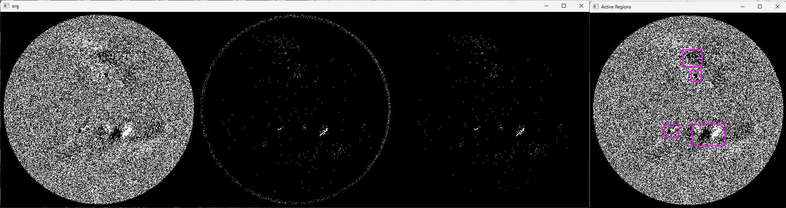
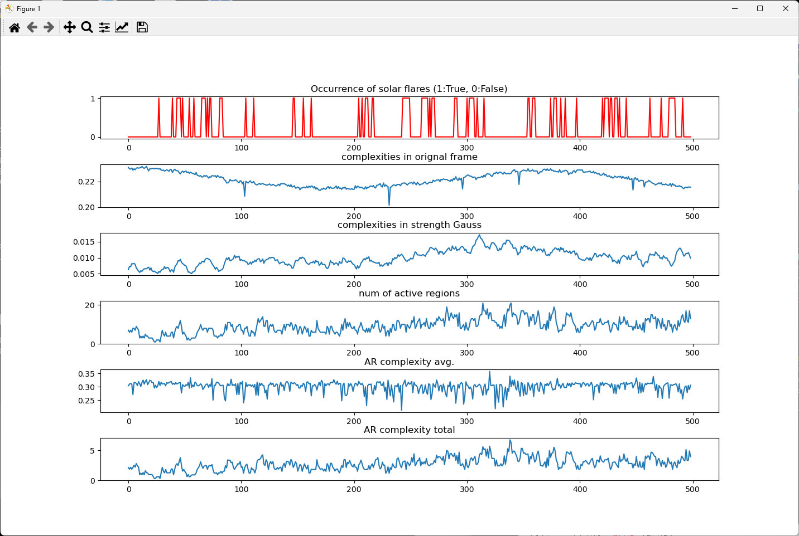

# predict-solar-flare

## ■特徴量抽出プログラム





### 事前準備

1. [サイト](https://drive.google.com/file/d/1ZI5VgdHUz8M8yawTZWq33nZL6dQVFyLr/view)からSW_data_GeoSciAI2024_train.zipを取得する
2. SW_data_GeoSciAI2024_train.zipを解凍する
3. 下記のpredict-solar-flareのルートフォルダへtrain_mag.npy及びtrain_label.npyを保存する

### 起動方法

```
git clone https://github.com/QC4U2-Qalchemist/predict-solar-flare.git
cd predict-solar-flare
python main.py --line-of-sight-mag-filepath train_mag.npy --label-solar-flare-filepath train_label.npy --gauss-thresh 100 --show-imgs
```

### パラメータ

* --line-of-sight-mag-filepath　LOS Magnetogramの時系列データのnpyを指定する
* --line-of-sight-mag-filepath　太陽フレア有無の時系列データのnpyを指定する
* --gauss-thresh　Active region抽出の閾値（ガウス）を指定する
* --show-imgs　中間画像を表示する。

### 出力ファイル

​	特徴量ファイル（features.npy）出力します。

### 処理内容

順番にLOS Magnetogramを読み込み、Active Regionsを抽出するなどの画像処理を実施して、特徴量を抽出してファイルに保存します。


## ■line_of_sight_magnetgram 画像可視化プログラム


### 事前準備

1. [サイト](https://drive.google.com/file/d/1ZI5VgdHUz8M8yawTZWq33nZL6dQVFyLr/view)からSW_data_GeoSciAI2024_train.zipを取得する
2. SW_data_GeoSciAI2024_train.zipを解凍する
3. 下記のpredict-solar-flareのルートフォルダへtrain_mag.npy及びtrain_label.npyを保存する


### 起動方法

```
git clone https://github.com/QC4U2-Qalchemist/predict-solar-flare.git
cd predict-solar-flare
python visualization_line_of_sight_magnetgram.py
```

### 処理内容

train_mag.npy及びtrain_label.npyを読み込んで、太陽line_of_sight_magnetgramを時系列で表示し、太陽フレアが発生する10フレーム前からカウントダウンし、左上に表示する。

### 操作方法

* [スペース]キー で再生・一時停止を切り換え

* [s]キーで10コマ巻き戻し

* [d]キーで1コマ戻し

* [f]キーで1コマ送り

* [g]キーで10コマ早送り

  
